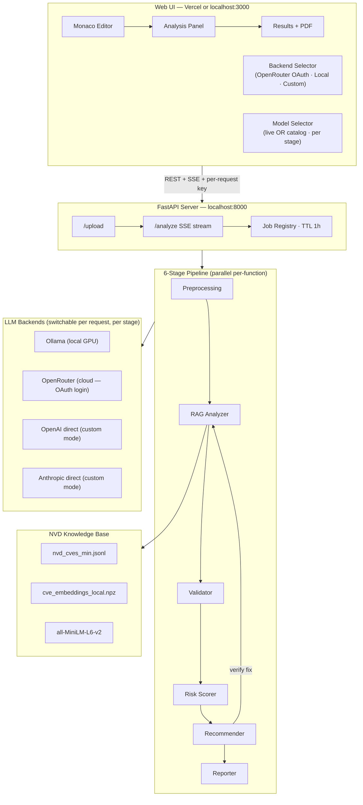

<div align="center">

<a href="https://github.com/Stradok/CODE-AI">
  
</a>

<br/>


[](https://github.com/Stradok/CODE-AI/actions)

<br/>


<br/><br/>

> **CODE-AI** is a research-grade security pipeline that scans Python source code for CVE vulnerabilities using RAG over the NVD database, validates findings with a second LLM to suppress false positives, scores risk, and generates verified patches. Run it fully locally on your own GPU, connect via OpenRouter OAuth in one click, or wire up your own OpenAI/Anthropic keys per pipeline stage — switchable at runtime from the UI. The server holds no API keys.

</div>

---

## Pipeline Overview

```
┌─────────────────────────────────────────────────────────────────────────────────┐
│                                                                                 │
│   Your Code                                                                     │
│      │                                                                          │
│      ▼                                                                          │
│  ┌─────────────────┐     ┌─────────────────┐     ┌─────────────────┐           │
│  │  1. Preprocess  │────▶│  2. RAG Detect  │────▶│  3. Validate    │           │
│  │  any LLM        │     │  any LLM        │     │  any LLM        │           │
│  │  AST + describe │     │  NVD cosine sim │     │  false-positive │           │
│  └─────────────────┘     └─────────────────┘     └────────┬────────┘           │
│                                                            │                    │
│                                                            ▼                    │
│  ┌─────────────────┐     ┌─────────────────┐     ┌─────────────────┐           │
│  │  6. Report      │◀────│  5. Fix & Verify│◀────│  4. Risk Score  │           │
│  │  any LLM        │     │  any LLM        │     │  rule-based     │           │
│  │  JSON + PDF     │     │  re-runs pipeline│     │  Critical/High/ │           │
│  └─────────────────┘     └─────────────────┘     │  Medium/Low     │           │
│                                                   └─────────────────┘           │
│                                                                                 │
│  All functions in a file run in parallel (stages 2–6) for maximum speed.       │
└─────────────────────────────────────────────────────────────────────────────────┘
```

Stage 5 is self-verifying: generated patches are re-run through stages 2–4 before being accepted. A fix is only marked `FIX_SUCCESSFUL` if it passes the full pipeline — not by the model's own claim.

---

## System Architecture



---

## Features

<table>
<tr>
<td width="50%">

**Security**
- RAG retrieval over the full NVD CVE database (168,960 CVEs)
- Second-model validation to eliminate false positives
- Verified patch generation — re-scanned before acceptance
- Risk scoring with Critical / High / Medium / Low priority

</td>
<td width="50%">

**Zero-key server — keys stay in the browser**
- **OpenRouter OAuth:** one-click Google login, key captured automatically
- **Local (Ollama):** 100% private, no API costs, requires a GPU
- **Custom per stage:** OpenAI key for RAG, Anthropic key for fixes, etc.
- Server holds no keys between requests — in, used, gone

</td>
</tr>
<tr>
<td>

**Performance**
- All functions in a file processed in parallel (stages 2–6)
- GPU semaphore prevents VRAM thrashing in local mode
- Streaming with deadline-based cancellation — no zombie requests
- 120 s per-call timeout (configurable), 1 retry on timeout

</td>
<td>

**Modularity**
- Live OpenRouter model catalog — pick any model per stage at runtime
- Stage-as-LLM pattern — models are config, not code
- FastAPI server + CLI share the same pipeline core
- Docker Compose for one-command local deployment
- Vercel frontend + local Docker backend for cloud access

</td>
</tr>
</table>

---

## Quick Start

### Option A — Docker (recommended)

> **Requirements:** Docker + Docker Compose · ~5 GB disk · CVE data files (see below)

```bash
# 1. Clone
git clone https://github.com/Stradok/CODE-AI.git
cd CODE-AI

# 2. Set up environment (no API keys needed — users supply them via the UI)
cp .env.example .env
# Only edit ALLOWED_ORIGINS if accessing from a remote frontend (e.g. Vercel)

# 3. Add CVE data files to backend/pipeline/data/  ← see Data section below

# 4. Start the backend
docker compose up -d backend

# Backend → http://localhost:8000
# Open http://localhost:3000 (or your Vercel URL) in your browser
```

The embedding model (`all-MiniLM-L6-v2`, ~90 MB) is downloaded automatically on first start.

### Option B — Local development

> **Requirements:** Linux/macOS · [uv](https://docs.astral.sh/uv/) · Node.js 20+ · ~25 GB free disk (models + data)

```bash
# 1. Clone
git clone https://github.com/Stradok/CODE-AI.git
cd CODE-AI

# 2. Install everything
make setup

# 3. Add CVE data files to backend/pipeline/data/  ← see Data section below

# 4. Start
make start
# Backend  → http://localhost:8000
# Frontend → http://localhost:3000
```

### CVE Data Files

The pipeline requires two files in `backend/pipeline/data/`:

| File | Description |
|---|---|
| `nvd_cves_min.jsonl` | NVD entries — one `{ "id", "description" }` per line |
| `cve_embeddings_local.npz` | Pre-computed `all-MiniLM-L6-v2` embeddings for the above |

These are generated from the NVD JSON feeds. See [`backend/README.md`](backend/README.md) for the full data preparation guide.

---

## Choosing Your LLM Backend

Click the **Backend** button in the toolbar to choose how inference runs. The choice is saved in your browser and sent with every request. **The server holds no API keys.**

### Option 1 — OpenRouter (recommended, no GPU needed)

Click **"Sign in with OpenRouter"** → a popup opens → sign in with Google → done. The key is captured automatically and stored in your browser. Access hundreds of models — free tier available, no credit card needed.

```
User clicks "Sign in" → openrouter.ai popup → Google login
  → key captured via OAuth → stored in localStorage
  → sent per-request → server uses it → forgets it
```

### Option 2 — Local GPU (Ollama)

Run models privately on your own machine. Zero data leaves your PC, zero API costs. Requires Ollama running with models pulled.

```bash
ollama pull deepseek-r1:8b llama3.1:8b qwen2.5-coder:7b mistral:7b
```

### Option 3 — Custom per stage

Use a different model and API key for each pipeline stage independently:

| Stage | Example | Key needed |
|---|---|---|
| Preprocessing | `openai/gpt-4o` | OpenAI key |
| CVE Detection | `openai/gpt-4o` | OpenAI key |
| Validation | `anthropic/claude-3-5-sonnet-20241022` | Anthropic key |
| Fix Generation | `anthropic/claude-3-5-sonnet-20241022` | Anthropic key |
| Reporting | `openai/gpt-4o-mini` | OpenAI key |

`openai/*` models call OpenAI directly. `anthropic/*` models call Anthropic directly. Everything else routes through OpenRouter.

### Model selector

In OpenRouter or Custom mode, the **Models** button fetches the live OpenRouter catalog (~200+ models) and lets you assign any model to any pipeline stage. Filter by free tier, search by name or provider. No config file edit needed.

---

## Deployment

### Vercel + local Docker (recommended for personal use)

```
Browser → Vercel (frontend) → your PC localhost:8000 (Docker backend)
```

1. Deploy frontend to Vercel — set `NEXT_PUBLIC_BACKEND_URL=http://localhost:8000`
2. Run backend locally: `docker compose up -d backend`
3. Set CORS in `.env`: `ALLOWED_ORIGINS=http://localhost:3000,https://your-app.vercel.app`
4. Open your Vercel URL → sign in with OpenRouter → start scanning

The browser (running on your machine) calls your local backend directly. Vercel's servers never touch your localhost.

---

## All Make Targets

```
make setup           Install all dependencies — backend + frontend
make start           Start both servers (backend :8000 + frontend :3000)
make stop            Stop all services including Ollama
make test            Run pipeline simulation (no Ollama required)
make lint            Ruff (backend) + ESLint (frontend)

make setup-backend   Backend only
make setup-frontend  Frontend only
make start-backend   Backend server only
make start-frontend  Frontend dev server only
```

---

## Configuration

All pipeline knobs live in `backend/config.yaml`. No code change needed to tune settings.

### Key settings

| Key | Default | Description |
|---|---|---|
| `settings.llm_timeout` | `120` | Per-call timeout in seconds |
| `settings.max_concurrent_llm_calls` | `1` | GPU semaphore (Ollama mode) |
| `settings.model_keep_alive` | `60` | Seconds before Ollama unloads idle model |
| `settings.max_function_workers` | `4` | Parallel threads per job (raise to 8+ for cloud) |
| `settings.top_k_cves` | `6` | CVEs retrieved per function via RAG |
| `settings.min_cve_similarity` | `0.25` | Cosine similarity cutoff |
| `settings.device` | `auto` | `auto` · `cpu` · `cuda` |

### Default models (all overridable in the UI)

| Stage | Default (Ollama) | Default (OpenRouter) |
|---|---|---|
| `preprocessing` | `deepseek-r1:8b` | `deepseek/deepseek-r1-distill-llama-8b:free` |
| `rag_analyzer` | `deepseek-r1:8b` | `deepseek/deepseek-r1-distill-llama-8b:free` |
| `validator` | `llama3.1:8b` | `meta-llama/llama-3.1-8b-instruct:free` |
| `recommender` | `qwen2.5-coder:7b` | `qwen/qwen-2.5-coder-7b-instruct:free` |
| `reporter` | `mistral:7b` | `mistralai/mistral-7b-instruct:free` |

All defaults can be overridden per-run from the **Models** panel in the UI.

---

## Repository Structure

```
CODE-AI/
├── docker-compose.yml                  One-command backend deployment
├── .env.example                        Environment variable reference (no keys needed)
├── Makefile                            Root orchestrator
│
├── backend/                            FastAPI server + pipeline
│   ├── Dockerfile                      Python 3.14 production image
│   ├── docker-entrypoint.sh            Downloads embedding model on first start
│   ├── api/
│   │   ├── server.py                   FastAPI app · SSE streaming · job registry
│   │   └── cli/main.py                 Interactive CLI runner
│   ├── pipeline/
│   │   ├── stages/                     6 pipeline stage modules
│   │   ├── llm/
│   │   │   ├── ollama_client.py        Local GPU backend (streaming + GPU semaphore)
│   │   │   ├── openrouter_client.py    Cloud backend + provider dispatcher
│   │   │   ├── anthropic_client.py     Direct Anthropic API (custom mode)
│   │   │   ├── context.py              Per-request contextvars (backend · key · stage)
│   │   │   ├── retry.py                Retry wrapper
│   │   │   ├── schemas.py              Pydantic output schemas per stage
│   │   │   └── json_parsing.py         Strip <think> tags, extract JSON
│   │   ├── reporting/                  JSON + PDF writers
│   │   ├── config/                     YAML loader (singleton)
│   │   └── data/                       CVE embeddings + NVD JSONL (git-ignored)
│   ├── tests/
│   │   └── integration/                simulate_pipeline · evaluator
│   ├── config.yaml                     All tunable knobs + default models
│   └── pyproject.toml
│
├── frontend/                           Next.js 16 web UI
│   ├── Dockerfile                      Multi-stage Node 20 build
│   ├── src/
│   │   ├── app/
│   │   │   ├── page.tsx                Main app
│   │   │   └── auth/callback/page.tsx  OpenRouter OAuth callback
│   │   ├── components/
│   │   │   ├── layout/
│   │   │   │   ├── toolbar.tsx         Upload · Analyze · Models · Backend · Status
│   │   │   │   ├── model-selector.tsx  Live OR catalog · per-stage model picker
│   │   │   │   └── backend-selector.tsx  OpenRouter OAuth · Local · Custom per stage
│   │   │   ├── analysis/               stage-progress · event-feed · function-list
│   │   │   ├── results/                vulnerability-card · severity-badge · fix-badge
│   │   │   └── reports/                report-summary · report-download
│   │   ├── stores/
│   │   │   ├── editor-store.ts         File + code state
│   │   │   ├── analysis-store.ts       Pipeline run state + SSE events
│   │   │   ├── model-store.ts          Per-stage model overrides
│   │   │   └── backend-store.ts        Backend mode + OAuth key (localStorage)
│   │   ├── hooks/
│   │   │   ├── use-sse.ts              SSE stream + event routing
│   │   │   └── use-health-check.ts     Backend liveness polling
│   │   └── types/                      events · report · api
│   └── package.json
│
├── .github/
│   ├── workflows/ci.yml                Lint + typecheck + simulate_pipeline
│   └── ISSUE_TEMPLATE/
└── logs/                               Session logs
```

---

## Tech Stack

<div align="center">

| Layer | Technology |
|---|---|
| LLM Inference (local) | Ollama · any locally pulled model |
| LLM Inference (cloud) | OpenRouter OAuth · OpenAI direct · Anthropic direct |
| Embeddings | sentence-transformers · all-MiniLM-L6-v2 |
| CVE Knowledge Base | NVD (National Vulnerability Database) · 168,960 CVEs |
| Backend | Python 3.14 · FastAPI · Pydantic · LangChain · uvicorn |
| Package Manager | [uv](https://docs.astral.sh/uv/) |
| Containerisation | Docker · Docker Compose |
| Frontend | Next.js 16 · React 19 · TypeScript · Tailwind CSS 4 · shadcn/ui |
| Editor Engine | Monaco Editor (powers VS Code) |
| State Management | Zustand (with localStorage persistence) |
| Deployment | Vercel (frontend) + Docker (backend) |
| CI | GitHub Actions |

</div>

---

## Team

<div align="center">

<table>
<tr>

<td align="center" width="200">
  <br/>
  <b>Amman Khawaja</b><br/>
  <sub>Architecture Designer<br/>Lead Developer</sub><br/>
  <a href="https://github.com/Stradok">
    
  </a>
</td>

<td align="center" width="200">
  <br/>
  <b>Dr Jawad</b><br/>
  <sub>Supervisor</sub>
</td>

<td align="center" width="200">
  <br/>
  <b>Mr Abdullah</b><br/>
  <sub>Co-Supervisor &<br/>Quality Assurance & Testing</sub>
</td>

<td align="center" width="200">
  <br/>
  <b>Mr Owais Ganae</b><br/>
  <sub>Group Member</sub>
</td>

<td align="center" width="200">
  <br/>
  <b>Hussain</b><br/>
  <sub>Group Member</sub>
</td>

</tr>
</table>

<br/>


</div>

---

## Contributing

See [backend/CONTRIBUTING.md](backend/CONTRIBUTING.md) for the full guide.

1. Fork and clone
2. `make setup`
3. Create a branch: `git checkout -b feat/my-feature`
4. Make changes and run `make lint`
5. Open a pull request

---

## License

[MIT](backend/LICENSE) © 2024 Cyberletics Lab


