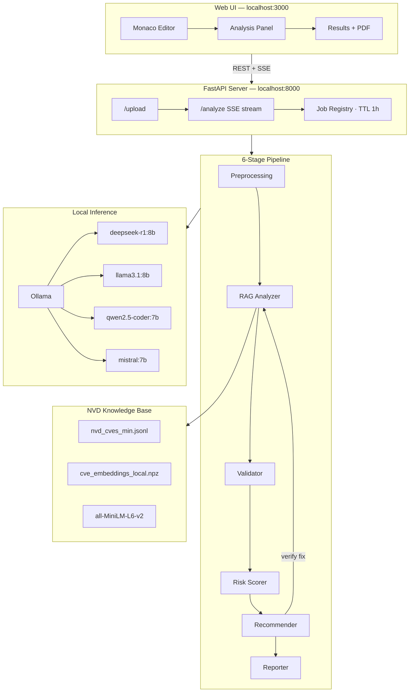

<div align="center">

<a href="https://github.com/Stradok/CODE-AI">
  
</a>

<br/>


[](https://github.com/Stradok/CODE-AI/actions)

<br/>


<br/><br/>

> **CODE-AI** is a research-grade security pipeline that scans Python source code for CVE vulnerabilities using RAG over the NVD database, validates findings with a second LLM to suppress false positives, scores risk, and generates verified patches — all running **100% locally** with no data leaving your machine.

</div>

---

## Pipeline Overview

```
┌─────────────────────────────────────────────────────────────────────────────────┐
│                                                                                 │
│   Your Code                                                                     │
│      │                                                                          │
│      ▼                                                                          │
│  ┌─────────────────┐     ┌─────────────────┐     ┌─────────────────┐           │
│  │  1. Preprocess  │────▶│  2. RAG Detect  │────▶│  3. Validate    │           │
│  │  deepseek-r1    │     │  deepseek-r1    │     │  llama3.1:8b    │           │
│  │  AST + describe │     │  NVD cosine sim │     │  false-positive │           │
│  └─────────────────┘     └─────────────────┘     └────────┬────────┘           │
│                                                            │                    │
│                                                            ▼                    │
│  ┌─────────────────┐     ┌─────────────────┐     ┌─────────────────┐           │
│  │  6. Report      │◀────│  5. Fix & Verify│◀────│  4. Risk Score  │           │
│  │  mistral:7b     │     │  qwen2.5-coder  │     │  rule-based     │           │
│  │  JSON + PDF     │     │  re-runs pipeline│     │  Critical/High/ │           │
│  └─────────────────┘     └─────────────────┘     │  Medium/Low     │           │
│                                                   └─────────────────┘           │
└─────────────────────────────────────────────────────────────────────────────────┘
```

Stage 5 is self-verifying: generated patches are re-run through stages 2–4 before being accepted. A fix is only marked `FIX_SUCCESSFUL` if it passes the full pipeline — not by the model's own claim.

---

## System Architecture


---

## Features

<table>
<tr>
<td width="50%">

**Security**
- RAG retrieval over the full NVD CVE database
- Second-model validation to eliminate false positives
- Verified patch generation — re-scanned before acceptance
- Risk scoring with Critical / High / Medium / Low priority

</td>
<td width="50%">

**Privacy**
- 100% local inference via Ollama
- No code, no results, no keys leave your machine
- CORS locked to `localhost` by default
- API key handled via env var only — never in config files

</td>
</tr>
<tr>
<td>

**Developer Experience**
- One-command install: `make setup`
- One-command run: `make start`
- Real-time SSE streaming in the web UI
- Monaco Editor (VS Code engine) embedded in browser

</td>
<td>

**Modularity**
- Swap any LLM by editing one line in `config.yaml`
- Stage-as-LLM pattern — models are config, not code
- FastAPI server + CLI share the same pipeline core
- PDF + JSON reports generated per job

</td>
</tr>
</table>

---

## Quick Start

> **Requirements:** Linux · [uv](https://docs.astral.sh/uv/) · Node.js 18+ · ~25 GB free disk (models + data)

```bash
# 1. Clone
git clone https://github.com/Stradok/CODE-AI.git
cd CODE-AI

# 2. Install everything (takes 15–30 min on first run — model downloads)
make setup

# 3. Add CVE data files to backend/pipeline/data/  ← see Data section below

# 4. Start
make start
# Backend  → http://localhost:8000
# Frontend → http://localhost:3000
```

### CVE Data Files

The pipeline requires two files in `backend/pipeline/data/`:

| File | Description |
|---|---|
| `nvd_cves_min.jsonl` | NVD entries — one `{ "id", "description" }` per line |
| `cve_embeddings_local.npz` | Pre-computed `all-MiniLM-L6-v2` embeddings for the above |

These are generated from the NVD JSON feeds. See [`backend/README.md`](backend/README.md) for the full data preparation guide.

---

## All Make Targets

```
make setup           Install all dependencies — backend + frontend
make start           Start both servers (backend :8000 + frontend :3000)
make stop            Stop all services including Ollama
make test            Run pipeline simulation (no Ollama required)
make lint            Ruff (backend) + ESLint (frontend)

make setup-backend   Backend only
make setup-frontend  Frontend only
make start-backend   Backend server only
make start-frontend  Frontend dev server only
```

---

## Configuration

All pipeline knobs live in `backend/config.yaml`. No code change needed to swap models.

| Key | Default | Description |
|---|---|---|
| `models.rag_analyzer` | `deepseek-r1:8b` | Primary CVE detection model |
| `models.validator` | `llama3.1:8b` | False-positive suppression model |
| `models.recommender` | `qwen2.5-coder:7b` | Patch generation model |
| `models.reporter` | `mistral:7b` | Report narration model |
| `settings.device` | `auto` | `auto` · `cpu` · `cuda` |
| `settings.llm_timeout` | `120` | Per-call timeout in seconds |
| `settings.top_k_cves` | `5` | CVEs retrieved per function via RAG |

---

## Repository Structure

```
CODE-AI/
├── backend/                        FastAPI server + pipeline
│   ├── api/
│   │   ├── server.py               FastAPI app · SSE streaming · job registry
│   │   └── cli/main.py             Interactive CLI runner
│   ├── pipeline/
│   │   ├── stages/                 6 pipeline stage modules
│   │   ├── llm/                    ollama_client · retry · schemas · json_parsing
│   │   ├── reporting/              JSON + PDF writers
│   │   ├── config/                 YAML loader (singleton)
│   │   └── data/                   CVE embeddings + NVD JSONL (git-ignored)
│   ├── tests/
│   │   └── integration/            simulate_pipeline · evaluator
│   ├── scripts/
│   │   ├── setup.sh                One-command dependency installer
│   │   └── start.sh                Server launcher
│   ├── config.yaml                 All tunable knobs
│   └── pyproject.toml
│
├── frontend/                       Next.js 15 web UI
│   ├── src/
│   │   ├── components/
│   │   │   ├── layout/             toolbar · ide-layout · status-bar
│   │   │   ├── analysis/           stage-progress · event-feed · function-list
│   │   │   ├── results/            vulnerability-card · severity-badge · fix-badge
│   │   │   └── reports/            report-summary · report-download
│   │   ├── stores/                 Zustand: editor-store · analysis-store
│   │   ├── hooks/                  use-sse · use-health-check
│   │   └── types/                  events · report
│   └── package.json
│
├── .github/
│   ├── workflows/ci.yml            Lint + typecheck + simulate_pipeline
│   └── ISSUE_TEMPLATE/
├── Makefile                        Root orchestrator
└── README.md
```

---

## Tech Stack

<div align="center">

| Layer | Technology |
|---|---|
| LLM Inference | Ollama · deepseek-r1:8b · llama3.1:8b · qwen2.5-coder:7b · mistral:7b |
| Embeddings | sentence-transformers · all-MiniLM-L6-v2 |
| CVE Knowledge Base | NVD (National Vulnerability Database) |
| Backend | Python 3.14 · FastAPI · Pydantic · LangChain · uvicorn |
| Package Manager | [uv](https://docs.astral.sh/uv/) |
| Frontend | Next.js 15 · React 19 · TypeScript · Tailwind CSS 4 · shadcn/ui |
| Editor Engine | Monaco Editor (powers VS Code) |
| State Management | Zustand |
| CI | GitHub Actions |

</div>

---

## Team

<div align="center">

<table>
<tr>

<td align="center" width="200">
  <br/>
  <b>Amman Khawaja</b><br/>
  <sub>Architecture Designer<br/>Lead Developer</sub><br/>
  <a href="https://github.com/Stradok">
    
  </a>
</td>

<td align="center" width="200">
  <br/>
  <b>Dr Jawad</b><br/>
  <sub>Supervisor</sub>
</td>

<td align="center" width="200">
  <br/>
  <b>Mr Abdullah</b><br/>
  <sub>Co-Supervisor&<br/>Quality Assurance & Testing</sub>
</td>

<td align="center" width="200">
  <br/>
  <b>Mr Owais Ganae</b><br/>
  <sub>Group Member</sub>
</td>

<td align="center" width="200">
  <br/>
  <b>Hussain</b><br/>
  <sub>Group Member</sub>
</td>

</tr>
</table>

<br/>


</div>

---

## Contributing

See [backend/CONTRIBUTING.md](backend/CONTRIBUTING.md) for the full guide.

1. Fork and clone
2. `make setup`
3. Create a branch: `git checkout -b feat/my-feature`
4. Make changes and run `make lint`
5. Open a pull request

---

## License

[MIT](backend/LICENSE) © 2024 Cyberletics Lab


